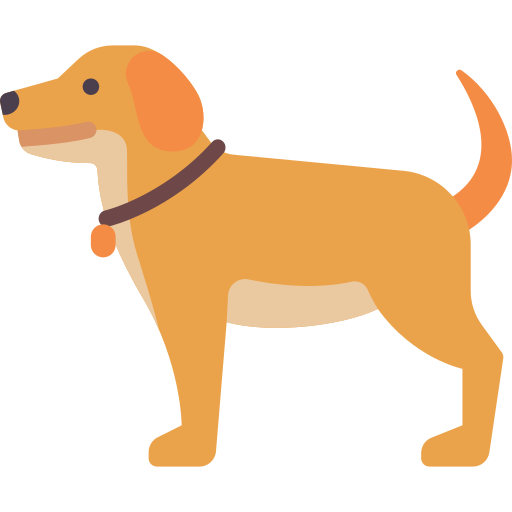
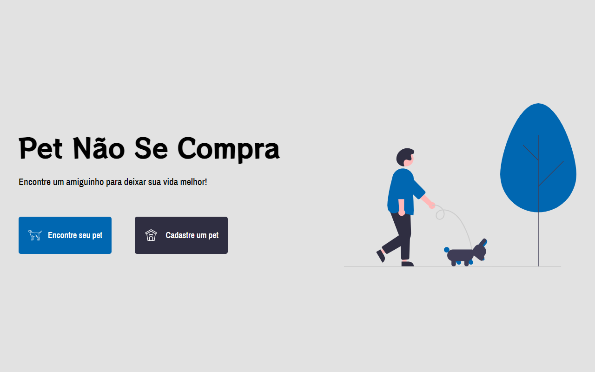

<h1 align="center">
    
		<p color="#212529">Pet não se compra</p>
</h1>

<p align="center">
  <a href="#-sobre">Sobre</a>&nbsp;&nbsp;&nbsp;|&nbsp;&nbsp;&nbsp;
  <a href="#-tecnologias">Tecnologias</a>&nbsp;&nbsp;&nbsp;|&nbsp;&nbsp;&nbsp;
  <a href="#-como-executar-o-projeto">Como executar</a>&nbsp;&nbsp;&nbsp;|&nbsp;&nbsp;&nbsp;
  <a href="#-licença">Licença</a>
</p>

<p align="center">
  

  
	
  
  <a href="https://github.com/pedromiiguel/Pet-nao-se-compra/commits/master">
    
  </a>

  
</p>

<h1 align="center">
    
</h1>


## 🔖 Sobre

Aplicação desenvolvido par aum projeto da faculdade. Os requisitos da aplicação web são  conter um módulo front-end, um módulo back-end e um banco de dados. O Pet não se compra é uma aplicação criada para adoção de cachorro e gatos, com o objetivo de divulgar animais que se encontram a situação de vulnerabilidade e abandono.


## 🚀 Tecnologias

Tecnologias utilizazadas no projeto:

- [Node.js](https://nodejs.org/en/)
- [Express](https://expressjs.com/pt-br/)
- [PostgreSQL](https://www.postgresql.org/)
- [Handlebars](https://handlebarsjs.com/)
- [Javascript](https://developer.mozilla.org/pt-BR/docs/Web/JavaScript)
- [HTML](https://developer.mozilla.org/pt-BR/docs/Web/HTML)
- [CSS](https://developer.mozilla.org/pt-BR/docs/Web/CSS)


## 🔧 Como executar o projeto

### Pré-requisitos

<p> É necessário possuir o Node.js instalado na máquina </p>
<p>E também possuir um gerenciador de tarefas NPM ou Yarn.</p>

```bash
# Clone este repositório
$ git clone https://github.com/pedromiiguel/Pet-nao-se-compra

# Acesse a pasta do projeto no terminal/cmd
$ cd projetoppi

# Instale as dependências
$ npm install

# Acesse a pasta database e insira as infomações de seu banco de dados postgres, no arquivo database.js

const client = new pg.Client({
  user: '',
  host: 'localhost',
  database: '',
  password: '',
  port: 5432
});

# Execute a aplicação em modo de desenvolvimento
$ npm start

# O servidor inciará na porta:3000 - acesse http://localhost:3333 
```

## 📝 Licença

Esse projeto está sob a licença MIT.

## :man_astronaut: Autor

#### Pedro Miguel

- Git Hub: <a href="https://github.com/pedromiiguel" target='_blanck' >@pedromiiguel</a>
- Linkedin: <a href="https://www.linkedin.com/in/pedro-miiguel" target='_blanck' >@pedromiiguel</a>